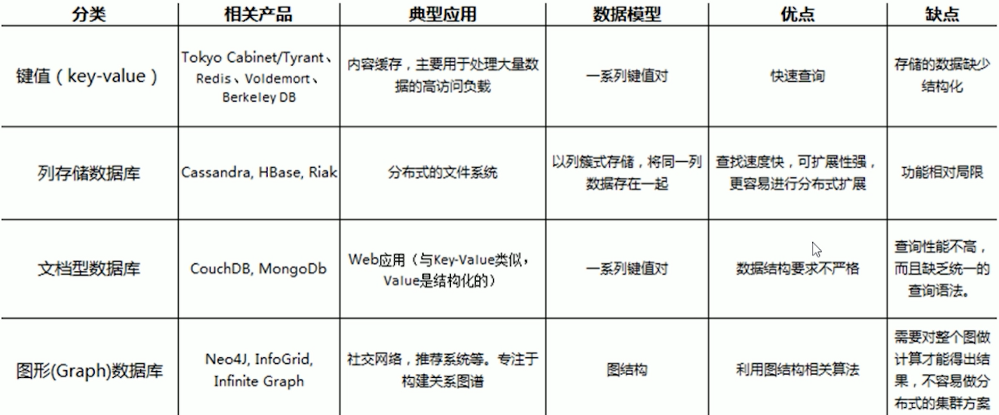
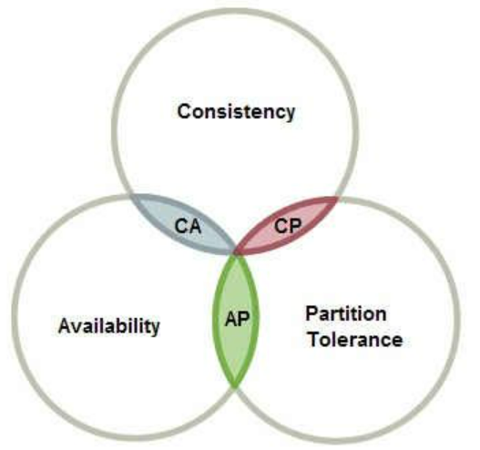
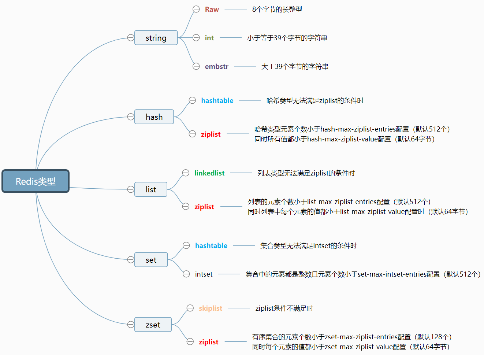

# 什么是NoSQL

NoSQL = Not Only SQL，意即`不仅仅是SQL`, 指的是`指的是非关系型的数据库`。

在web1.0时代，人们对于要求并不高，所拥有用的功能也不多，因此对于NoSQL的需求也不大。

随着进入web2.0时代，人们发现以前的技术框架对新的业务，新的功能逐渐支撑不起来，NoSQl自然而然随着时代进步跟着发展起来的。

## RDBMS vs NoSQL

**RDBMS（关系型数据库）**

- 高度组织化结构化数据
- 结构化查询语言（SQL） (SQL)
- 数据和关系都存储在单独的表中
- 数据操纵语言，数据定义语言
- 严格的一致性
- 基础事务

**NoSQL**

- 代表着不仅仅是SQL
- 没有声明性查询语言
- 没有预定义的模式
- 主要四类存储模式：键-值对，列存储，文档存储，图形数据库
- 最终一致性，而非ACID属性
- 非结构化和不可预知的数据
- CAP定理
- 高性能，高可用性和可伸缩性

**CAP理论**

* Consistency（一致性）
* Availability（可用性）
* Partition tolerance（分区容忍性）

① **一致性：**

对于客户端的每次读操作，要么读到的是最新的数据，要么读取失败。换句话说，一致性是站在分布式系统的角度，对访问本系统的客户端的一种承诺：要么我给您返回一个错误，要么我给你返回绝对一致的最新数据，不难看出，其强调的是数据正确。

② **可用性：**

任何客户端的请求都能得到响应数据，不会出现响应错误。换句话说，可用性是站在分布式系统的角度，对访问本系统的客户的另一种承诺：我一定会给您返回数据，不会给你返回错误，但不保证数据最新，强调的是不出错。

③ **分区容忍性：**

由于分布式系统通过网络进行通信，网络是不可靠的。当任意数量的消息丢失或延迟到达时，系统仍会继续提供服务，不会挂掉。换句话说，分区容忍性是站在分布式系统的角度，对访问本系统的客户端的再一种承诺：我会一直运行，不管我的内部出现何种数据同步问题，强调的是不挂掉。

CAP理论最重要的一点 —— `C`，`A`，`P` 三者不可共存，最多两者共存，一般要么在`CP`，要么在`AP`中做出选择。

Redis是采用`AP`策略的;

# Redis的介绍

2008年，Redis的作者Salvatore Sanfilippo在开发一个叫LLOOGG的网站时，需要实现一个高性能的队列功能，最开始是使用MySQL来实现的，但后来发现无论怎么优化SQL语句都不能使网站的性能提高上去，再加上自己囊中羞涩，于是他决定自己做一个专属于LLOOGG的数据库，这个就是Redis的前身。

后来，Salvatore Sanfilippo将Redis1.0的源码开放到GitHub上，可能连他自己都没想到，Redis后来如此受欢迎。

redis能干嘛？

* 缓存
* 排行榜系统

* 计数器应用
* 社交网络

* 消息队列系统
* .....

redis不能干嘛？

Redis并不是万金油，有很多适合它解决的问题，也有很多不合适它解决的问题。

从`数据规模`和`数据冷热`的角度来进行分析;

数据规模，可以从字面意思理解，就是数量的大小 

数据冷热，热数据通常是指需要频繁操作的数据，反之为冷数据

redis不适合解决冷数据和大规模的数据，及其业务场景。

## Redis的数据类型

### Redis类型

+ **string**
  + Raw -- 8个字节的长整型
  + int -- 小于等于39个字节的字符串
  + embstr -- 大于39个字节的字符串
+ **hash**
  + hashtable -- 哈希类型无法满足ziplist的条件时
  + ziplist -- 哈希类型元素个数小于hash-max-ziplist-entries配置（默认512个）\n同时所有值都小于hash-max-ziplist-value配置（默认64字节）
+ **list**
  + linkedlist
    列表类型无法满足ziplist的条件时
  + ziplist
    列表的元素个数小于list-max-ziplist-entries配置（默认512个）\n同时列表中每个元素的值都小于list-max-ziplist-value配置时（默认64字节）
+ **set**
  + hashtable -- 集合类型无法满足intset的条件时
  + intset -- 集合中的元素都是整数且元素个数小于set-max-intset-entries配置（默认512个）
+ **zset**
  + skiplist -- ziplist条件不满足时
  + ziplist -- 有序集合的元素个数小于zset-max-ziplist-entries配置（默认128个）\n同时每个元素的值都小于zset-max-ziplist-value配置（默认64字节）
    
